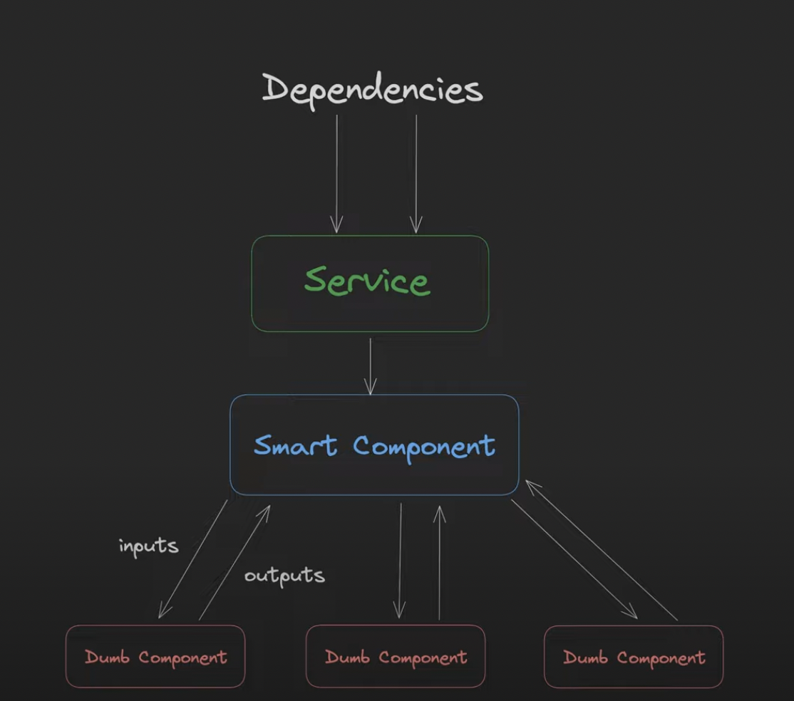
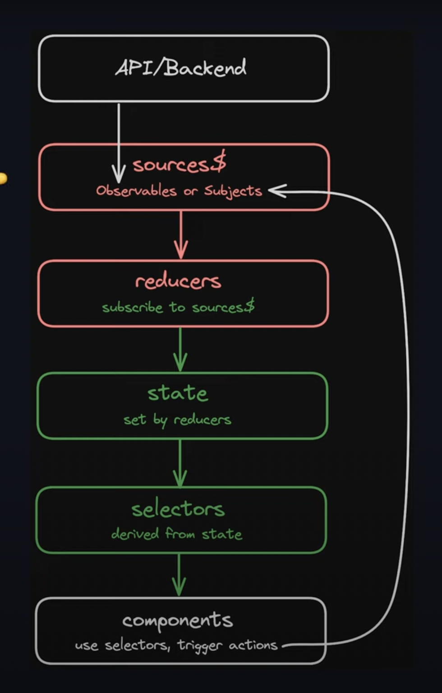
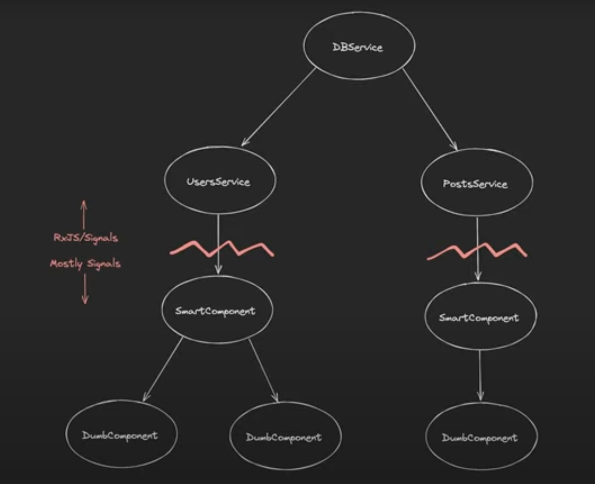
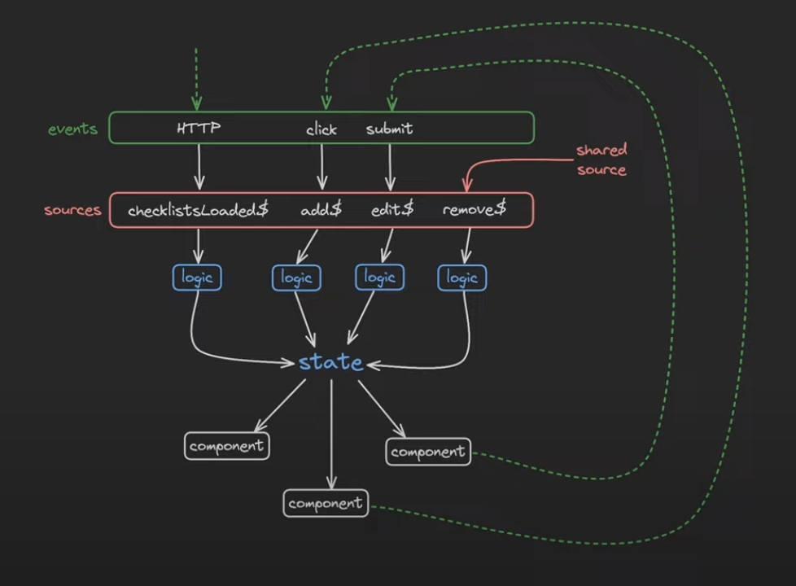

# Ngx Struct

Ngx Struc is a command-line interface tool designed to streamline the process of setting up new feature structures within Angular projects. By automating the creation of commonly used directory structures and files, this tool significantly reduces the time and effort involved in the initial setup of features, services, and stores in Angular applications.

## Features

- **Interactive Scaffold Creation:** Promptly generates a customizable structure for your Angular feature, including essential directories and files.
- **Configurable Components:** Based on user input, it creates a feature component with the option of marking it as standalone or nested within another feature.
- **Service and Store Generation:** Automatically generates service and store files within the `data` directory, pre-populated with template code for state management and data handling, leveraging RxJS for reactive data services.
- **Easy Integration:** Designed to be seamlessly integrated into existing Angular projects, enhancing development workflows without disrupting the current architecture.

## How It Works

Upon execution, Ngx Struct prompts the user for the name of the new feature. It then creates a dedicated folder for the feature, subdividing it into `data`, `feature`, and `ui` directories. The `data` directory gets populated with a service and a store file, each containing boilerplate code to kickstart development. Depending on user preference, it either creates a new Angular component within the `feature` directory or leaves it empty for nested features, streamlining the development process for both standalone and nested components.

## Getting Started

This CLI tool is designed to be installed globally and used within any Angular project to facilitate rapid development setup and consistent code organization.

### Installation

To install the Angular Scaffold CLI globally on your system, run:

`npm install --dev ngx-struct`

### Usage

Navigate to your Angular project's root directory and run:

`ngx-struct`

Follow the interactive prompts to specify your feature's name and whether it's a standalone or nested feature. The CLI will handle the rest, creating the specified structure and files within your project.

---

## Project Structure Overview

This script automates the setup of a new feature within an Angular application, organizing code by its responsibilities and creating a consistent directory structure. The structure can be either flat for single features or nested for features containing sub-features. Below is an explanation of the created directories and files.

### Base Structure

For every new feature, the script generates the following base directories and files within the `src/app` directory:

- `data/`: Contains services and stores necessary for the feature's data management.
  - `*.service.ts`: It is the file that houses all the logic belonging to this feature.
  - `*.store.ts`: A store file for managing the state of the feature on memory (local/session storage).
- `feature/` (optional): Created for features that are not nested. It includes the Angular component files:
  - `*.component.ts`: The typeScript (standalone angular component) file defining what we call Smart Components.
- `ui/`: This folder contains what are known as dummy components, which are merely presentation components.

### Nested Structure

For nested features, the script additionally creates a `feature/` directory within the specified parent feature directory. Inside this `feature/` directory, a similar structure to the base one is replicated for the nested feature:

- `data/`: Contains services and stores for the nested feature.
- `feature/`: Includes the Smart component files for the nested feature, mirroring the base structure.
- `ui/`: Dummy components.




### Data Diagram

Within the feature.service.ts component, 
a crud-type structure is generated by default 
with the following key points:
- `sources$`: Act as triggers for different actions.
- `reducers`: Handle state update logic in response to actions triggered by sources$. 
Each subscription listens to its respective source$ and updates the private states as necessary.
- `state`: Private states related to the feature.
- `selectors`: They offer a way to derive data from the private states, ensuring the UI components get the latest updated values.



> The idea behind the connection between rxjs and signals is to exploit the potential of both tools.



> The final result should be something like this:



### Example Structure

Assuming we create a feature named `dashboard` without nesting:

```
src/app/dashboard/ 
├── data/ 
│   ├── dashboard.service.ts 
│   └── dashboard.store.ts 
├── ui/ 
└── feature/     
├── dashboard.component.ts     
├── dashboard.component.html     
└── dashboard.component.scss
```

For a nested feature scenario, where `dashboard` contains a nested feature named `reports`:

```
src/app/dashboard/ 
├── data/ 
│   ├── dashboard.service.ts 
│   └── dashboard.store.ts 
├── ui/ 
└── feature/     
    ├── dashboard.component.ts     
    ├── dashboard.component.html     
    ├── dashboard.component.scss     
    └── reports/         
        ├── data/         
        │   ├── reports.service.ts         
        │   └── reports.store.ts         
        ├── ui/         
        └── feature/             
            ├── reports.component.ts             
            ├── reports.component.html             
            └── reports.component.scss
```

### Data layer example `*.service.ts` & `*.store.ts`
```angular2html
@Injectable({
  providedIn: 'root',
})
export class SomeService {
  private readonly someApiService: SomeApiService = inject(SomeApiService);
  private readonly someStore: SomeStore = inject(SomeStore);

  //state
  private someState = signal<T>({
    data: [],
    status: 'loading',
    error: null,
  });

  //selectors
  data = computed(() => this.someState().data);
  status = computed(() => this.someState().status);

  //sources
  retry$ = new Subject<void>();
  private someDataLoaded$ = this.retry$.pipe(
    startWith(null),
    switchMap(() =>
      this.someApiService.getSomeData().pipe(
        retry({
          delay: error => {
            this.someState.update(state => ({ ...state, error, status: 'error' }));
            return this.retry$;
          },
        }),
      ),
    ),
  );
  otherAction$ = new Subject<any>();

  constructor() {
    //reducers
    this.someDataLoaded$.pipe(takeUntilDestroyed()).subscribe({
      next: response => {
        this.someState.update(state => ({
          ...state,
          data: response.data,
          status: 'success',
        }));
      },
      error: error => this.someState.update(state => ({ ...state, error, status: 'error' })),
    });

    this.otherAction$.pipe(takeUntilDestroyed()).subscribe((subjectReceived: any) => {
      if (subjectReceived) {
        // do something
      } else {
        // do something
      }
    });

    this.retry$
      .pipe(takeUntilDestroyed())
      .subscribe(() => this.someState.update(state => ({ ...state, status: 'loading' })));

    effect(() => {
      if (this.someState().status === 'success') {
        this.someStore.saveLocalData(this.data());
      }
    });
  }
```

```angular2html
export const LOCAL_STORAGE = new InjectionToken<Storage>('window local storage object', {
  providedIn: 'root',
  factory: () => {
    return inject(PLATFORM_ID) === 'browser' ? window.localStorage : ({} as Storage);
  },
});

@Injectable({
  providedIn: 'root',
})
export class SomeStore {
  storage = inject(LOCAL_STORAGE);

  loadSomeLocalData(): Observable<any[]> {
    const data = this.storage.getItem('data');
    return of(data ? (JSON.parse(data) as data[]) : []);
  }

  saveLocalData(data: data[]): void {
    this.storage.setItem('data', JSON.stringify(data));
  }
```

>With this approach we make sure that all the logic is in the same file and we expose actions that allow us to modify the state indirectly, also exposing only the necessary information and not the entire state.
> 
>The components (smart ones) only see the sources (actions) and the selectors (partial state)

### Usage

- **Creating a Feature:** Run the script and follow the prompts to specify the feature name. If the feature is not nested, the script creates the base structure.
- **Creating a Nested Feature:** When prompted, indicate that the component is nested and provide the name of the child component. The script then generates both the parent and nested feature structures.

This structure emphasizes separation of concerns by dividing the feature into logical sections, making it scalable and maintainable. It supports both simple and complex feature developments, accommodating various project sizes and complexities.

---